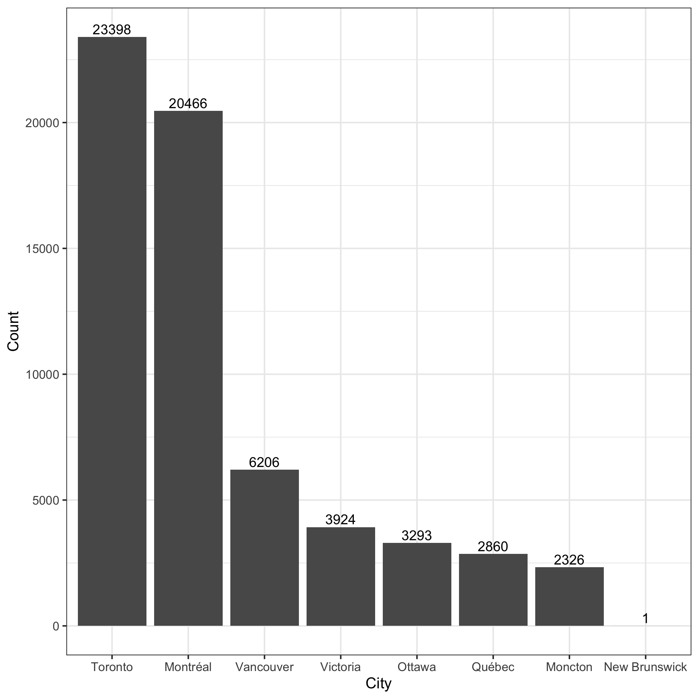
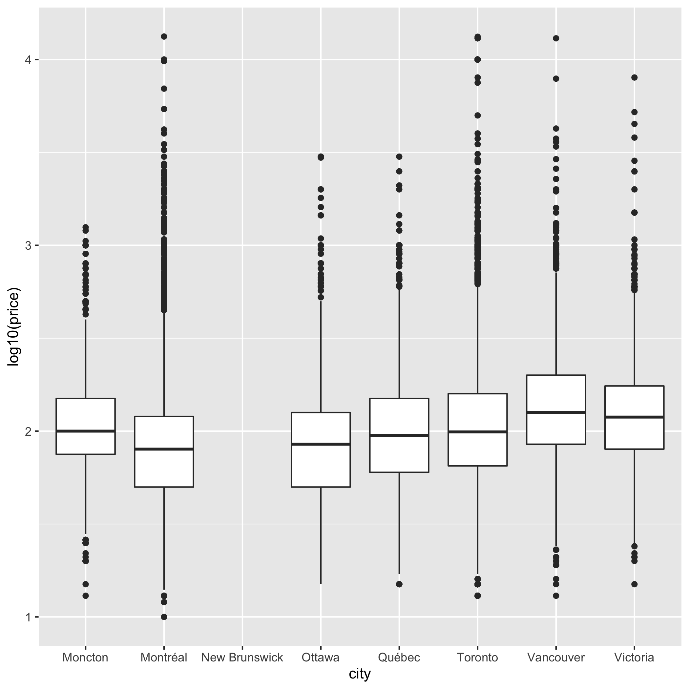

```{r package, message=FALSE, include=FALSE}
library(tidyverse)
library(here)
library(corrplot)
library(forcats)
```


## Introduction

According to Statistics Canada, a recording breaking **22.1 million international tourists from abroad visited Canada in 2019.** Hotels have always been the mainstay for accommodations but the prices per night can be unaffordable for visitors looking to stay long-term for tourism or work. Airbnb was founded in 2008 and has since been proven to be a successful online platform to match hosts with unused space with international or local guests looking for an affordable place to lodge. Although it is often more affordable than hotels, **Airbnb does not have a direct effect on the listing prices and ultimately leaves the hosts to decide the listing prices**. In this analysis, we want to investigate which factors, ranging from if the host is a superhost or not to the number of bathrooms, are most likely influencing the price of Airbnb listings for cities in Canada. This predicitive tool may potentially help travellers better understand the reasoning behind the listed price of certain Canadian Airbnb listings. 

## Research Question

In this analysis, we aim to investigate the influence of various factors on the price of Airbnb listings across various Canadian cities to see which ones are most likely to impact the listed price. Which factors, ranging from property type to number of bedrooms, are most likely playing a role in determining the price of Canadian Airbnb listings?

## Exploratory Data Analysis

First, we read in the dataset.

```{r load data, message=FALSE}
data <- readr::read_csv(here("Data", "cleaned_data.csv"))
```

### 1. What is the number of Airbnb listings in different Canadian cities?
```{r, echo=FALSE}
Toronto_listings <- data %>% 
                      filter(city == "Toronto") %>%
                      summarize(Toronto_Listings = nrow(.))

NB_listings <- data %>%
                filter(city == "New Brunswick") %>%
                summarize(Brunswisk_listings = nrow(.))
```
The barplot below shows the number of listings in different cities. From the plot, we can see that Toronto has the most number of listings (`r Toronto_listings`) and New Brunswick has the least number of listings (`r NB_listings`). 



### 2. How many Airbnb superhosts are there in different Canadian cities?
```{r, echo=FALSE}
victoria_host <- data %>%
                  filter(city == "victoria") %>%
                  summarize(true_host = sum(host_is_superhost, 
                                        na.rm = TRUE)/nrow(.)*100)
montreal_host <- data %>%
                  filter(city == "Montreal") %>%
                  summarize(true_host = sum(host_is_superhost,
                                            na.rm = TRUE)/nrow(.)*100)
```


The proportional bar chart below shows the percentage of superhosts in different cities. From the plot, Victoria seems to have the largest percentage of superhosts (`r victoria_host`%), while Montreal seems to have the smallest percentage of superhosts (`r montreal_host`%).


### 3. Is there a relationship between the number of accommodates and other features of the listing?

From the correllogram below, there is a strong relationship between the number of accommodates and the number of beds in the unit. This may cause a problem when performing linear regression analysis because some predictors are collinear. To solve the collinearity problem, we may decide to not use all of the variables (accommodates, bathrooms, bedrooms, and beds) as predictors in the linear regression model.


### 4. What is the distribution of the price per night in different Canadian cities?

The side-by-side boxplots shows the price per night (after log10 transformation) distribution in different cities. From the plots, we can see that there are some extremely high prices in the dataset. Further analysis will be required to figure out the reason for the extreme prices. Otherwise, we may need to consider them as outliers.



## Analysis Methods (Linear Regression)

## Results


## Conclusions/Discussion

## References

Statistics Canada. (2020, February 21). Travel between Canada and other countries, December 2019. Retrieved from https://www150.statcan.gc.ca/n1/daily-quotidien/200221/dq200221b-eng.htm?indid=3635-2&indgeo=0