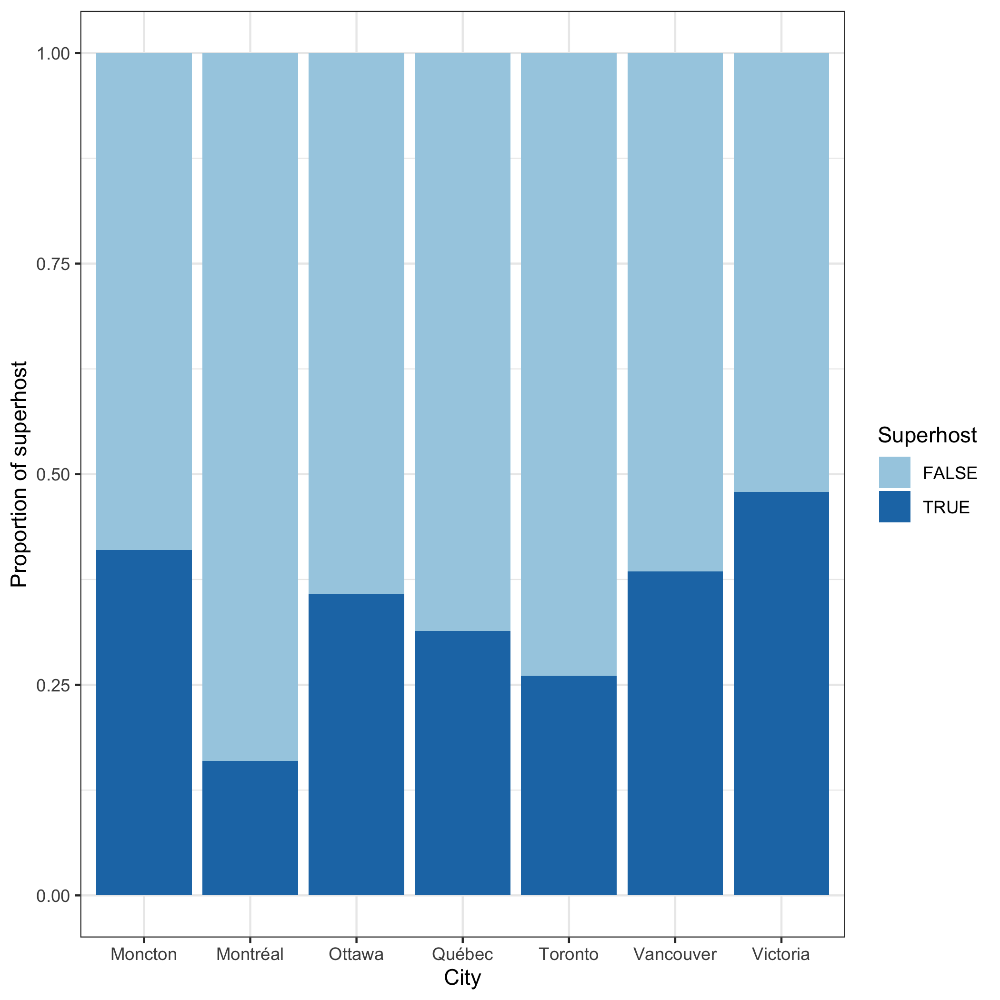
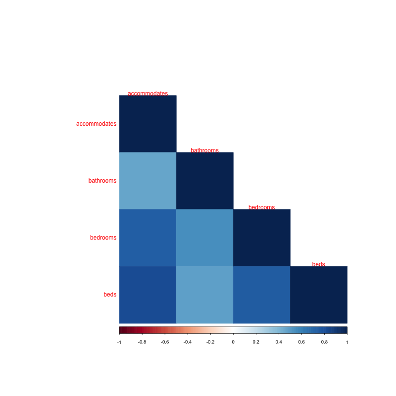
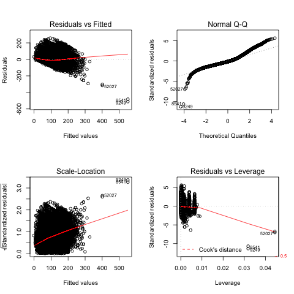

```{r package, message=FALSE, include=FALSE}
library(tidyverse)
library(here)
library(corrplot)
library(forcats)
library(testthat)
library(broom)
```


## Introduction

According to Statistics Canada, a recording breaking **22.1 million international tourists from abroad visited Canada in 2019.** Hotels have always been the mainstay for accommodations but the inflated prices per night can become unaffordable for visitors looking to stay long-term for tourism or work. Airbnb was founded in 2008 and has since been proven to be a successful online platform to match hosts with unused space together with international or local guests looking for an affordable place to lodge. Although it is often more affordable than hotels, **Airbnb does not have a direct effect on the listing prices and ultimately leaves the hosts to decide the listing prices**. In this analysis, we want to investigate which factors, ranging from if the host is a superhost or to the number of bathrooms, are most likely influencing the price of Airbnb listings in Canadian cities. This predicitive tool may potentially help travellers better understand the reasoning behind the listed price of certain Canadian Airbnb listings and help them decide if a hotel or Airbnb is better suited for their accommodation needs. 

## Research Question

In this analysis, we aim to investigate the influence of various variables on the price of Airbnb listings across various Canadian cities to see which ones are most likely to impact the listed price. Which variables, ranging from property type to number of bedrooms, are most likely playing a role in determining the price of Canadian Airbnb listings?

## Data Description

The [Data](https://github.com/STAT547-UBC-2019-20/group_3_mksm1228_sihaoyu1220/tree/master/Data) folder contains raw Airbnb listings data for Montreal, New Brunswick, Ottawa, Quebec, Toronto, Vancouver, and Victoria. The datasets were obtained from the [Inside Airbnb](http://insideairbnb.com/new-york-city/) project, conceived and compiled by Murray Cox and John Morrix in 2019. Each row represents a single listing with detailed information such as location, price, and rating score. The cleaned dataset can be accessed [here](https://github.com/STAT547-UBC-2019-20/group_3_mksm1228_sihaoyu1220/blob/master/Data/cleaned_data.csv). 

| Variable      | Type          | Description  |
| ------ |:------:| ------------------- |
| host_is_superhost | String  | whether the host is a super host (TRUE or FALSE). |
| city | String | City of the listing belongs to. One exception: New Brunswick is a Province. |
| property_type | String | Property type of the listing. |
| room_type | String | Room type: Entire Room, Hotel room, Private room, or Shared room. |
| accommodates | Int | The number of people that can be accommodated in the unit. |
| bathrooms | Int | The number of bathroom in the unit.|
| bedrooms | Int | The number of bedrooms in the unit. |
| beds | Int | The number of beds in the unit. |
| cancellation_policy | String | Strictness of the cancellation policy. |
| price | Int | Price per night. |

## Exploratory Data Analysis

In this section, four plots are produced to give an insight into the distribution of the dataset. First, we read in the dataset.

```{r load data, message=FALSE}
data <- readr::read_csv(here("Data", "cleaned_data.csv"))
```

### 1. What is the number of Airbnb listings in different Canadian cities?

```{r, echo=FALSE}
Toronto_listings <- data %>% 
                      filter(city == "Toronto") %>%
                      summarize(Toronto_Listings = nrow(.))
NB_listings <- data %>%
                filter(city == "New Brunswick") %>%
                summarize(Brunswisk_listings = nrow(.))
```
The barplot below shows the number of listings in different Canadian cities. From the plot, we can see that Toronto has the most number of listings (`r Toronto_listings`) and New Brunswick has the least number of listings (`r NB_listings`). 


### 2. How many Airbnb superhosts are there in different Canadian cities?
```{r, echo=FALSE}
victoria_host <- data %>%
                  filter(city == "victoria") %>%
                  summarize(true_host = sum(host_is_superhost, 
                                        na.rm = TRUE)/nrow(.)*100)
montreal_host <- data %>%
                  filter(city == "Montreal") %>%
                  summarize(true_host = sum(host_is_superhost,
                                            na.rm = TRUE)/nrow(.)*100)
expect_match("htmlpdf", "d")
```


The proportional bar chart below shows the percentage of superhosts in different cities. From the plot, Victoria seems to have the largest percentage of superhosts (`r victoria_host`%), while Montreal seems to have the smallest percentage of superhosts (`r montreal_host`%).




### 3. Is there a relationship between the number of accommodates and other features of the listing?

From the correllogram below, there is a strong relationship between the number of accommodates and the number of beds in the unit. This may cause a problem when performing linear regression analysis because some predictors are collinear. To solve the collinearity problem, we may decide to not use all of the variables (accommodates, bathrooms, bedrooms, and beds) as predictors in the linear regression model.



### 4. What is the distribution of the price per night in different Canadian cities?

The side-by-side boxplots shows the price per night (after log10 transformation) distribution in different cities. From the plots, we can see that there are some extremely high prices in the dataset. Further analysis will be required to figure out the reason for the extreme prices. Otherwise, we may need to consider them as outliers.


## Analysis Methods

To identify which variables are most likely influencing the price of Canadian Airbnb listings, we developed an analysis protocol which consists of 3 steps.  
1) Remove all the outliers 
2) Fit a linear regression model
3) Perform model diagnostics to check the assumptions and the model performance

### Step 1: Remove Outliers

We classified an observation as an outlier if it fell below `Q1-1.5*IQR` or above `Q3+1.5*IQR`, where Q1 and Q3 represents the first and third quantile of all the observations in the corresponding city; IQR means interquartile range (`Q3-Q1`). 

### Step 2: Fit a linear regression model

We built a full model for `price` by including all the potential predictors mentioned in the Data Description section. Next, we performed variable selection. Since the `property type` variable had too many levels (44 levels), it was not appropriate to include this in the linear regression model. In addition, the `bed` variable was removed because it was highly correlated with `accommodates`, `bathrooms`, and `bedrooms`.

### Step 3: Model Diagnostics

Four plots were produced for model checking. The first plot is a residual vs. fitted values plot. It is useful for checking the assumption of linearity. The second plot is a QQ plot and this is used to check the normality assumption of the residuals. The third plot is a scale-location plot and this is useful for checking the assumption of homoscedasticity. The fourth plot is a Cook's distance plot and this shows the measure of the influence of each observation on the regression coefficients.

## Results

Let's look at the results of the linear regression model. 

```{r}
lm <- readRDS(here::here("RDS","step_lm.RDS"))
knitr::kable(tidy(lm))
```

- The coefficient of `superhost` is positive and this means that if the host is a superhost, the Airbnb price will be higher than if a host was not a superhost.
- Montreal is a baseline `city` meaning that the Airbnb price in Montreal is the lowest compared to the other cities. In contrast, the Airbnb price in Vancouver is the highest. On average, the price in Vancouver is \$50 higher than the price in Montreal using our model.  
- For the `room type` variable, apartment is the baseline. If the room type is a hotel room, the price is higher. However, if the room type is a private room, the price is lower. Finally, if the room type is a shared room, the price is even lower at about \$64. 
- The coefficient of `accommodates` is 7 which means that for each extra accommodate, the Airbnb price increases by \$7 on average. 
- The coefficient of `bathroom` is 10 which means that for each extra bathroom, the Airbnb price increases by \$10 on average.
- The coefficient of `bedroom` is 9 which means that for each extra bathroom, the Airbnb price increases by \$9 on average.
- For the `cancellation policy` variable, flexible cancellation is the baseline. Airbnb listings with a moderate cancellation policy has a lower price while the Airbnb listings with a strict or super strict cancellation policy has a higher price. 

Next, let's take a look at the model diagnostics:



There is an increasing trend in the scale-location plot, so the assumption of homoscedasticity may not hold. From the Cook's distance plot, there are several influential points (far right), which may require us to remove in the future analysis.

## Conclusions/Discussion

In conclusion, there appears to be certain variables that have a significant effect on Canadian Airbnb listings. Variables such as superhost, city, room type, number of accommodates, number of bathrooms, number of bedrooms, and cancellation policy. However, the model does not seem to fit very well based on the model diagnostics. A possible reason is that there are too many categorical variables included in the linear regression model, which is one of the limitations for this study. For future analysis, we will consider removing the influential points and performing ANOVA instead of linear regression. 

## References

Statistics Canada. (2020, February 21). Travel between Canada and other countries, December 2019. Retrieved from https://www150.statcan.gc.ca/n1/daily-quotidien/200221/dq200221b-eng.htm?indid=3635-2&indgeo=0