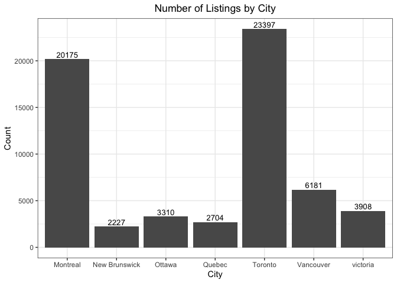
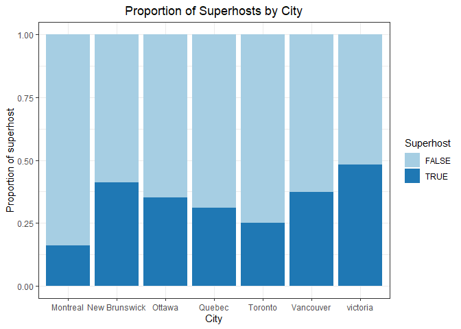
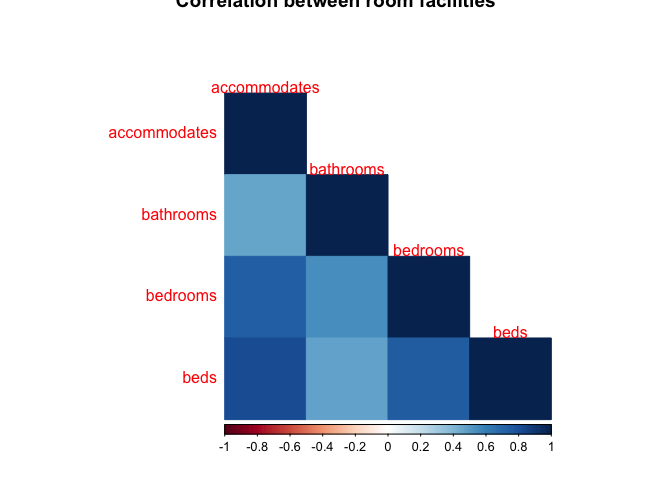
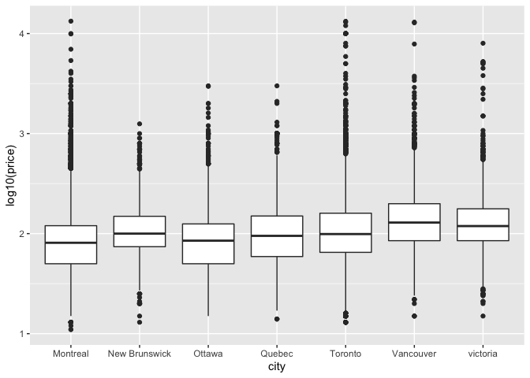

Airbnb predictive pricing tool for tourists coming to Canada
================

  - [Introduction](#introduction)
  - [Data Description](#data-description)
  - [Exploring the Dataset](#exploring-the-dataset)
      - [1. Bar Chart](#bar-chart)
      - [2. Proportional Bar Chart](#proportional-bar-chart)
      - [3. Correllogram](#correllogram)
      - [4. Side-by-side boxplots](#side-by-side-boxplots)
  - [Research Question](#research-question)
  - [Plan of Action](#plan-of-action)
  - [References](#references)

## Introduction

According to Statistics Canada, a recording breaking **22.1 million
international tourists from abroad visited Canada in 2019.** Hotels have
always been the mainstay for accommodations but the prices can become
unaffordable for visitors looking to stay long-term for tourism or work.
Airbnb was founded in 2008 and has since been proven to be a successful
online platform to match hosts with unused space with international or
local guests looking for an affordable place to lodge. Although it is
often more affordable than hotels, **Airbnb does not have a direct
effect on the listing prices and leaves the hosts to decide the listing
prices**. In this analysis, we want to investigate which factors,
ranging from the location of the listing to the number of bathrooms, are
most likely influencing the price of Airbnb listings for cities in
Canada. This predicitive tool may potentially help travellers better
understand the reasoning behind the listed price of certain Canadian
Airbnb listings.

## Data Description

\<\<\<\<\<\<\< HEAD \<\<\<\<\<\<\< HEAD The
[Data](https://github.com/STAT547-UBC-2019-20/group_3_mksm1228_sihaoyu1220/tree/master/Data)
folder contains raw Airbnb listings data for Montreal, New Brunswick,
Ottawa, Quebec, Toronto, Vancouver, and Victoria. The datasets were
obtained from the [Inside
Airbnb](http://insideairbnb.com/new-york-city/) project, conceived and
compiled by Murray Cox and John Morrix in 2019. Each row represents a
single listing with it’s detailed information such as location, price,
and rating score. The cleaned dataset can be assessed
[here](https://github.com/STAT547-UBC-2019-20/group_3_mksm1228_sihaoyu1220/tree/master/Data/cleaned_data).
<<<<<<< HEAD
Some useful variables are summarized below: ======= The
[Data](https://github.com/STAT547-UBC-2019-20/group_3_mksm1228_sihaoyu1220/tree/master/Data)
folder contains raw Airbnb listings data for Montreal, New Brunswick,
Ottawa, Quebec, Toronto, Vancouver, and Victoria. The datasets were
obtained from the [Inside
Airbnb](http://insideairbnb.com/new-york-city/) project, conceived and
compiled by Murray Cox and John Morrix in 2019. Each row represents a
single listing with it’s detailed information such as location, price,
and rating score. The cleaned dataset can be accessed
[here](https://github.com/STAT547-UBC-2019-20/group_3_mksm1228_sihaoyu1220/tree/master/Data/cleaned_data).
Details for the cleaning process are decribed in the section Plan of
Action. Some useful variables are summarized below: \>\>\>\>\>\>\>
upstream/master ======= master The
[Data](https://github.com/STAT547-UBC-2019-20/group_3_mksm1228_sihaoyu1220/tree/master/Data)
folder contains raw Airbnb listings data for Montreal, New Brunswick,
Ottawa, Quebec, Toronto, Vancouver, and Victoria. The datasets were
obtained from the [Inside
Airbnb](http://insideairbnb.com/new-york-city/) project, conceived and
compiled by Murray Cox and John Morrix in 2019. Each row represents a
single listing with it’s detailed information such as location, price,
and rating score. The cleaned dataset can be accessed
[here](https://github.com/STAT547-UBC-2019-20/group_3_mksm1228_sihaoyu1220/tree/master/Data/cleaned_data).
Details for the cleaning process are decribed in the section Plan of
Action. Some useful variables are summarized below:

The
[Data](https://github.com/STAT547-UBC-2019-20/group_3_mksm1228_sihaoyu1220/tree/master/Data)
folder contains raw Airbnb listings data for Montreal, New Brunswick,
Ottawa, Quebec, Toronto, Vancouver, and Victoria. The datasets were
obtained from the [Inside
Airbnb](http://insideairbnb.com/new-york-city/) project, conceived and
compiled by Murray Cox and John Morrix in 2019. Each row represents a
single listing with detailed information such as location, price, and
rating score. The cleaned dataset can be accessed
[here](https://github.com/STAT547-UBC-2019-20/group_3_mksm1228_sihaoyu1220/tree/master/Data/cleaned_data).
Details for the cleaning process are decribed in the Plan of Action
section. Some useful variables are summarized below: master
\>\>\>\>\>\>\> 5aa6cc1b6685638c0577c1b5f222eb713c070a4f
=======
Details for the cleaning process are decribed in the section Plan of
Action. Some useful variables are summarized
below:
>>>>>>> upstream/master

| Variable             |  Type  | Description                                                                 |
| -------------------- | :----: | --------------------------------------------------------------------------- |
| host\_is\_superhost  | String | whether the host is a super host (TRUE or FALSE).                           |
| city                 | String | City of the listing belongs to. One exception: New Brunswick is a Province. |
| property\_type       | String | Property type of the listing.                                               |
| room\_type           | String | Room type: Entire Room, Hotel room, Private room, or Shared room.           |
| accommodates         |  Int   | The number of people that can be accommodated in the unit.                  |
| bathrooms            |  Int   | The number of bathroom in the unit.                                         |
| bedrooms             |  Int   | The number of bedrooms in the unit.                                         |
| beds                 |  Int   | The number of beds in the unit.                                             |
| cancellation\_policy | String | Strictness of the cancellation policy.                                      |
| price                |  Int   | Price per night.                                                            |

## Exploring the Dataset

First, we read in the dataset.

``` r
data <- readr::read_csv(here("Data", "cleaned_data.csv"))
```

### 1\. Bar Chart

The barplot below shows the number of listings in different cities. From
the plot, we can see that Toronto has the most number of listings
(23397) and New Brunswick has the least number of listings (2227).

``` r
data %>% 
  ggplot(aes(x = city))+
  geom_bar(stat="count")+
  labs(x = "City", y = "Count", title = "Number of Listings by City") + 
  geom_text(stat='count',aes(label=..count..), vjust=-0.3, size=3.5) + 
  theme_bw() +
  theme(plot.title = element_text(hjust = 0.5))
```

<!-- -->

### 2\. Proportional Bar Chart

The proportional bar chart below shows the percentage of superhost in
different cities. From the plot, Victoria seems to have the largest
percentage of suphosts (almost 50%), while Montreal seems to have the
smallest percentage of superhosts (less than 25%).

``` r
host <- distinct(data, host_id, .keep_all = TRUE)
host %>% 
  filter(host_is_superhost == TRUE | host_is_superhost == FALSE) %>% 
  ggplot()+
  geom_bar(mapping = aes(x=city, fill = host_is_superhost),
           position = "fill")+
  ylab("Proportion of superhost")+
  xlab("City")+
  ggtitle("Proportion of Superhosts by City")+
  scale_fill_brewer(name = "Superhost", palette="Paired")+
  theme_bw()+
  theme(plot.title = element_text(hjust = 0.5))
```

<!-- -->

### 3\. Correllogram

From the correllogram below, there is a strong relationship between the
number of accommodates and the number of beds in the unit. This may
cause a problem when performing linear regression analysis because some
predictors are collinear. To solve the collinearity problem, we may
decide to not use all of the variables (accommodates, bathrooms,
bedrooms, and beds) as predictors in the linear regression model.

``` r
data[7:10] <- sapply(data[7:10] , as.double)
corr <- cor(na.omit(data[7:10]))
corrplot(corr, method="color", tl.srt=0,type="lower",
         title = "Correlation between room facilities")
```

<!-- -->

### 4\. Side-by-side boxplots

The side-by-side boxplots shows the price per night (after log10
transformation) distribution in different cities. From the plots, we can
see that there are some extremely high prices in the dataset. For
further analysis we need to figure out the reason for the extreme
prices. Otherwise, we need to delete the extreme points as outliers.

``` r
ggplot(data)+geom_boxplot(aes(city, log10(price), group = city))
```

<!-- -->

# Research Question

In this analysis, we aim to investigate the influence of various factors
on the price of Airbnb listings across various Canadian cities to see
which ones are most likely to impact the listed price.

# Plan of Action

\<\<\<\<\<\<\< HEAD \<\<\<\<\<\<\< HEAD We will first establish that the
provided datasets by InsideAirbnb can be utilized by thoroughly ensuring
there is less than 5-10% of missing data. Next, we will perform a linear
regression analysis between the price of the Airbnb listing and the
various factors provided in the datasets. ======= We will first
establish that the provided datasets by InsideAirbnb can be utilized by
thoroughly ensuring there is less than 5-10% of missing data. Next, we
will combine the datasets from 7 cities in Canada together and clean it.
Since the original dataset has a lot of variables (106 variables), we
need to select useful variables to make the dataset look clean. Then, we
will perform some exploratory data analysis based on the variable
selected. Finally, we will perform a linear regression analysis between
the price of the Airbnb listing and the various factors provided in the
datasets. \>\>\>\>\>\>\> upstream/master ======= master We will first
establish that the provided datasets by InsideAirbnb can be utilized by
thoroughly ensuring there is less than 5-10% of missing data. Next, we
will combine the datasets from 7 cities in Canada together and clean it.
Since the original dataset has a lot of variables (106 variables), we
need to select useful variables to make the dataset look clean.

We will first establish that the provided datasets by InsideAirbnb can
be utilized by thoroughly ensuring there is less than 5-10% of missing
data. Next, we will combine the datasets from 7 cities in Canada
together and clean it. Since the original dataset has a lot of variables
<<<<<<< HEAD
(106 variables), we need to select useful variables to clean the
dataset. Next, we will perform some exploratory data analysis based on
the variables selected. Finally, we will perform a linear regression
analysis between the price of the Airbnb listing and the various factors
provided in the datasets. master \>\>\>\>\>\>\>
5aa6cc1b6685638c0577c1b5f222eb713c070a4f
=======
(106 variables), we need to select useful variables to make the dataset
look clean. Then, we will perform some exploratory data analysis based
on the variable selected. Finally, we will perform a linear regression
analysis between the price of the Airbnb listing and the various factors
provided in the
datasets.
>>>>>>> upstream/master

# References

<https://www150.statcan.gc.ca/n1/daily-quotidien/200221/dq200221b-eng.htm?indid=3635-2&indgeo=0>
