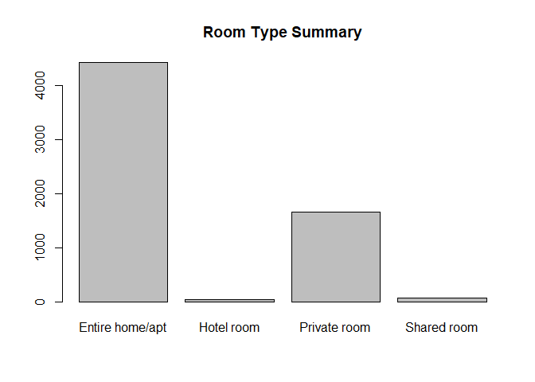
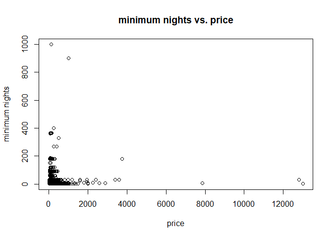

Milestone 1
================

``` r
data$id<-as.factor(data$id)
nlevels(data$id) 
```

    ## [1] 6181

There are 6181 listings.

``` r
data$host_id<-as.factor(data$host_id)
nlevels(data$host_id) #4261 hosts.
```

    ## [1] 4261

There are 4261 hosts.

Select useful variables.

``` r
data <- data %>% 
  select(id, host_id, host_is_superhost, host_listings_count, neighbourhood_cleansed, property_type, room_type, accommodates, bathrooms, bedrooms, beds, price, weekly_price, monthly_price, security_deposit, cleaning_fee, guests_included, extra_people, minimum_nights, maximum_nights, review_scores_rating)
```

Some EDA.

``` r
barplot(table(data$room_type), main="Room Type Summary")
```

<!-- -->

``` r
data$price <- as.numeric(gsub('[$,]', '', data$price))
plot(data$price, data$minimum_nights, main="minimum nights vs. price", xlab="price", ylab="minimum nights")
```

<!-- -->
