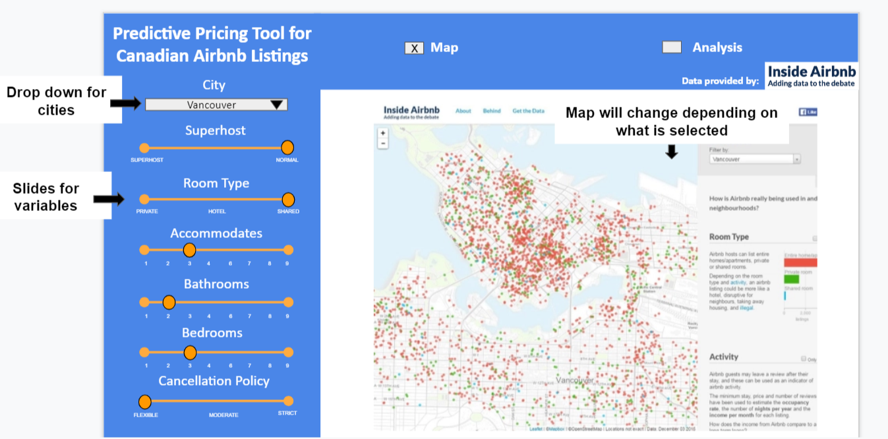
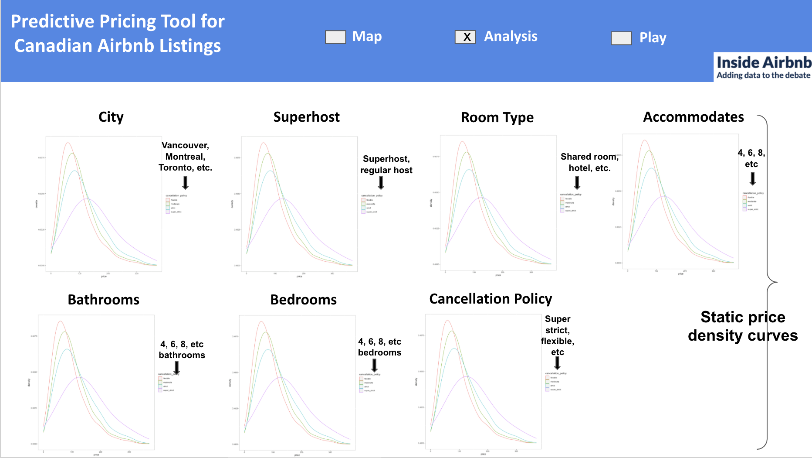

# Predictive Model for the Price of Canadian Airbnb Listings

This is a group project by Team Project 3 members, @mksm1228 and @sihaoyu1220, for the 2019-2020 STAT547M session. 

## Dataset

We will be utilizing the Canadian Airbnb listings dataset which contains summary information and metrics for listings in Canada generated by Inside Airbnb. The data was sourced from publicly available information from the official Airbnb site. It has been analyzed, cleaned and aggregated by Inside Airbnb. 

## Research Question

Which factors are most likely to influence the price of Airbnb listings in Canadian cities? 

## Usage

1. Clone this repository.

2. Check the contents of each folder and read all READMEs.

3. Ensure the following packages are installed:
- ggplot2
- here
- tidyverse
- corrplot
- data.table
- knitr
- broom
- testthat
- docopt

4. Run the following scripts (in order) **with** the appropriate arguments specified.

```r
1. USE GNU MAKE  
if < > is used , this means that multiple options can be inputted. 

# clean all the folders
make clean

# Restore all the files
make all

2. USE GNU MAKE ON INDIVIDUAL ITEMS
# download the data
make Data/<Canadian city.csv> 
For example: make Data/montreal_raw.csv

# run exploratory data analysis
make Images/<image.png> 
For example: make Images/Number_of_listings.png

# linear regression analysis
make RDS/step_lm.rds

# linear regression plot
make Images/Model_Diagnostics.png

# knit report to html or pdf
make Docs/Final_Report.html 
make Docs/Final_Report.pdf

3. RUN EACH RSCRIPT INDIVIDUALLY
# load all data
Rscript Scripts/load_data.R --data_url=http://data.insideairbnb.com/canada/

# access cleaned data
Rscript Scripts/clean_data.R --path=Data --filename=cleaned_data

# explorating data analysis
Rscript Scripts/EDA.R --data_path=Data/cleaned_data.csv --image_path=Images

# perform linear regression
Rscript Scripts/linear_regression.R --datafile=cleaned_data.csv

# knitting to html or pdf
Rscript Scripts/knitting.R --rmd_file=Final_Report.rmd
```

## **Dashboard Proposal**

### Dashboard Description

This app has two features. One is to show the pricing density of variables of interest and the other is to show a map of the listings distribution for each city. The user will be able to choose between seeing the analysis or the map. Using a drop-down list, users will be able to select the Canadian city they are interested in and also be able to filter the variables of interest using sliders. For example, whether they want a superhost or not, room type (entire room, shared room, etc.), number of accommodates, number of bathrooms, number of bedrooms, and how strict they want the cancellation policy (flexible, super strict, etc.). Users can also see how the variables of interest influence the pricing density plots and the listings distribution map. 

### Usage Senarios

Jason is a travel enthusiast from Europe and Canada is his next destination along with a group of friends. They plan to visit several Canadian cities. While browsing on Airbnb.com, he notices several listings that are similar in price but with different characteristics. He wants to filter this down to a couple choices to get the most value for his money, essentially figure out which characteristics he is paying more or less for. If Jason visits our "Predictive Pricing Tool for Canadian Airbnb Listings" dashboard, he can filter through a list of variables that we have determined to have an effect of some sort on the listing price. He selects the variables for two listings in Toronto that are similar in price. The first listing is a private room with one bathroom whereas the other listing is a shared room with two bathrooms. He plays around with the filters and notices that as he increases the number of bathrooms, the more expensive it becomes compared to if he were to filter between the room types. To supplement this information, he can select to see the map to get an idea of the location of the listings. Jason is now looking at Vancouver, one of the destinations on his itinerary. He adjusts the variables for their accommodation needs but notices that despite having the same variables selected for other cities, Jason realizes that Vancouver Airbnb listings are the most expensive compared the other Canadian cities. He arrives to the conclusion that Vancouver is unfortunately one of the most expensive cities to travel to. Thus, this tool helps him better understand the reasoning for Airbnb listing prices and helps him decide which characteristics in Airbnb listings to look for.

### Dashboard Sketch



